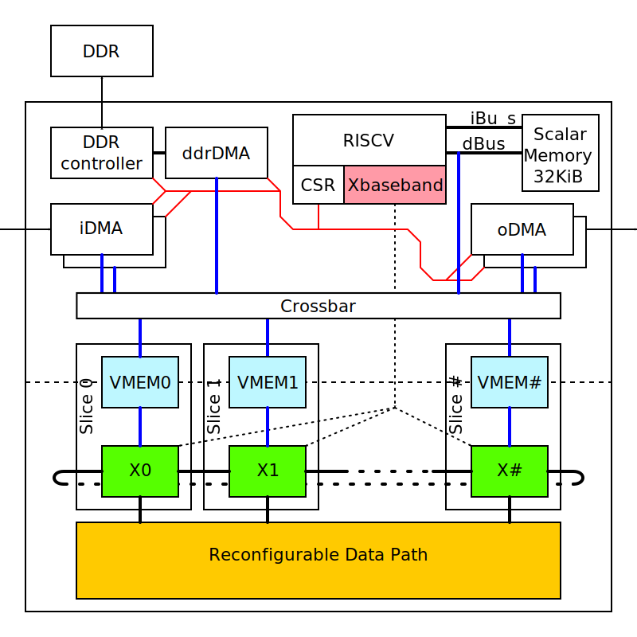
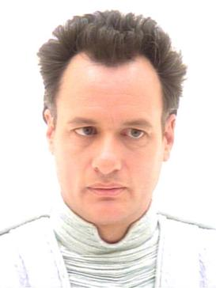

Engine that Q

## Block Diagram

  * [RISCV](#riscv-core) processor core with [memory and peripheral](#riscv-system)
  * [Xbaseband](https://github.com/siglabsoss/riscv-baseband) instruction extension
plugin to control vector processor
  * [Vector processor](#vector-processor) organizes parallel memory access.
  * [Reconfigurable Data Path](#reconfigurable-data-path) main DSP computational unit.
  * Input / Output streaming [DMA](#dma) controllers
  * DDR Memory controller and DMA

## RISCV core

  * 5 stage pipeline RISCV RV32I core
  * no cache
  * [VexRsicv](https://github.com/SpinalHDL/VexRiscv) framework
  * custom instruction extensions to control vector processor

## Vector Processor

Array of identical slices controlled by the same **Xbaseband** instruction.
Each slice contains memory bank, can manage multiple memory pointers, and
organize data traffic between vector memory and the *datapath*.

For more details see: https://github.com/siglabsoss/riscv-baseband

## Reconfigurable Data Path

The Reconfigurable Data Path (**datapath**) sub-module is the major
computational part of the Q-engine. Most of complex arithmetic DSP operations
performed by the units of the *datapath*. Vector processor push input data into
the *datapath* and pull computed results out of the *datapath*. Specific
*datapath* structure can be changed by Vector processor to perform different
computational algorithms.

For more details see: https://github.com/siglabsoss/datapath

## RISCV system

  * tightly coupled memory blocks
    * Instruction SRAM memory (iMEM) 8KiB
    * Data SRAM memory (dMEM) 1KiB
  * Control bus (APB) to program DMA block CSRs
  * Interrupt controller

## DMA

  * Each DMA have control bus (APB) and data bus (AXI) connection.
  * End-Point DMA (connected to ADC / DAC) will have highest priority.
  * Each DMA may trigger RISCV interrupt
  * queue of descriptors

### Input DMA

  * Takes start address and vector length from CSR
  * Pull data from streaming interface
  * Writes data to the Vector Memory sequentially
  * Sends interrupt when done

### Output DMA

  * Takes start address and vector length from CSR
  * Reads data from the Vector Memory sequentially
  * Pushes into streaming interface
  * Sends interrupt when done

### DDR DMA

  * Takes descriptor from CSR
    * start read address
    * start write address
    * vector length
  * Reads data from one memory
  * Writes data to the other memory
  * Sends interrupt when done

### DMA to Memory Datapath

### Crossbar

  *Arbitrates memory accesses for multiple dmas or memory read/write peripherals
  *Routes read data stream to the appropriate channel

##  Q tip

Oh, you'd like me to connect the dots for you, lead you from A to B to C, so that your puny mind could comprehend? How boring.

